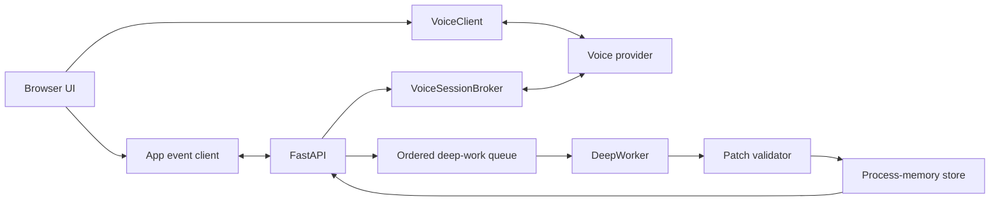

# Architecture

## Decision

The application has two correlated but independently progressing channels:

1. **Voice channel:** captures speech, returns a short acknowledgment, and reports
   normalized lifecycle events.
2. **Document channel:** serializes deeper agent work and atomically updates one
   canonical document.

The voice acknowledgment may state intent and the next analysis step. Only the
document channel may state findings, evidence, confidence, or recommendations.

For the WebRTC reference adapter, generated RTP audio is recorded rather than played
directly. Playback begins only after the completed response transcript passes the
acknowledgment guard. This trades some first-audio latency for a hard authority boundary:
rejected findings are never audible.

## Components

Provider-specific negotiation stays in adapters. Application commands, events, queue
semantics, semantic patches, state, and rendering remain provider-neutral.

## State and authority

- The backend owns session, turn, event, queue, document, diff, version, and opaque
  provider-correlation state.
- The browser projects validated events and stores no durable application state.
- The patch service validates an entire operation set against a base version before any
  commit.
- A reasoned no-op completes without advancing the document version.
- Revert creates a new version containing an earlier snapshot.
- Restart intentionally deletes all application state.

## Failure independence

- Voice connection, playback, or interruption does not cancel accepted deep work.
- Agent or patch failure does not remove already committed text.
- Queue cancellation suppresses cooperative and late provider output.
- A live provider error remains visible; it never selects a local fallback.

## Azure reference mapping

- `AzureVoiceLiveClient` and `AzureVoiceLiveBroker` own preview WebRTC/data/control
  details.
- `FoundryDeepWorker` owns Prompt Agent conversation and local tool dispatch.
- `DefaultAzureCredential` provides keyless local authentication.
- Bicep and Terraform create management-plane prerequisites.
- `scripts/bootstrap_agent.py` owns data-plane Prompt Agent version creation/reuse.

Current provider details are volatile. Follow links in [Azure setup](azure-setup.md)
rather than treating this diagram as a region, model, quota, or pricing guarantee.
