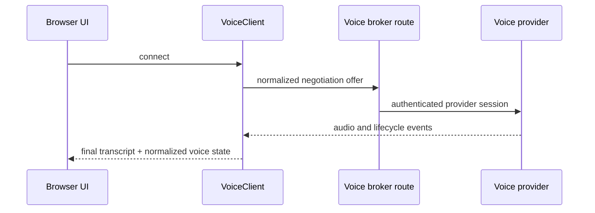
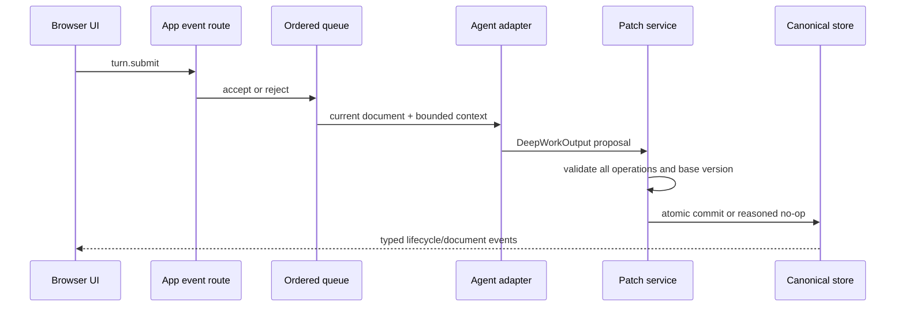

# Solution map

## Component inventory

| Area | Responsibility | Entry point |
| --- | --- | --- |
| Backend composition | Validated provider selection and process lifetime | `backend/main.py` |
| Agent providers | Lazy factory and `DeepWorker` adapters | `backend/providers/agent/` |
| Voice providers | `VoiceSessionBroker`, disabled and Azure adapters | `backend/providers/voice/` |
| Ordered work | FIFO, backpressure, cancellation, lifecycle | `backend/services/deep_work_service.py` |
| Document authority | Atomic semantic validation, versions, revert | `backend/services/patch_service.py` |
| State/events | Process-memory canonical state and replay | `backend/services/conversation_store.py`, `event_hub.py` |
| Browser composition | Session startup and correlated UI state | `src/app.tsx` |
| Browser voice | `VoiceClient` factory and adapters | `src/providers/voice/` |
| Contracts | Schemas, fixtures, Python/TypeScript validators | `contracts/`, `backend/domain/`, `src/contracts/` |
| Infrastructure | Equivalent management-plane implementations | `infra/bicep/`, `infra/terraform/` |
| Bootstrap | Idempotent Prompt Agent version setup | `scripts/bootstrap_agent.py` |

## Browser-to-voice sequence

Credentials and provider endpoints stay on the backend. Audio does not enter the app
event WebSocket or application storage.

## Transcript-to-document sequence

## Runtime configuration flow

`VOICE_PROVIDER` and `AGENT_PROVIDER` are parsed independently. The selected factories
import only the requested adapters. `/api/capabilities` exposes provider names and safe
feature flags, never configured values. The UI displays both immutable selections.

## Trust boundaries

- Browser input and provider events are untrusted and bounded.
- Provider metadata never authorizes app resources.
- Agent prose and tool arguments are untrusted until validated.
- Environment files, IaC inputs, outputs, state, and cloud logs are private operator
  material.
- The repository contains synthetic fixtures only.

## Change this when

| Goal | Change | Validate |
| --- | --- | --- |
| Add a voice provider | backend/frontend voice adapters and factories | lifecycle, interruption, sanitization, no-import tests |
| Add an agent provider | `DeepWorker` adapter and agent factory | output, authority, cancellation, parity tests |
| Change document shape | domain models, schemas, fixtures, validators, UI | schema generation, freeze revision, all mode tests |
| Change queue behavior | deep-work service | FIFO, capacity, cancellation, late-result tests |
| Change Azure resources | both IaC paths and logical contract | build, validate, parity, two tenant runs |
| Change public claims | README, testing/evidence docs | link and sensitive-reference validation |
